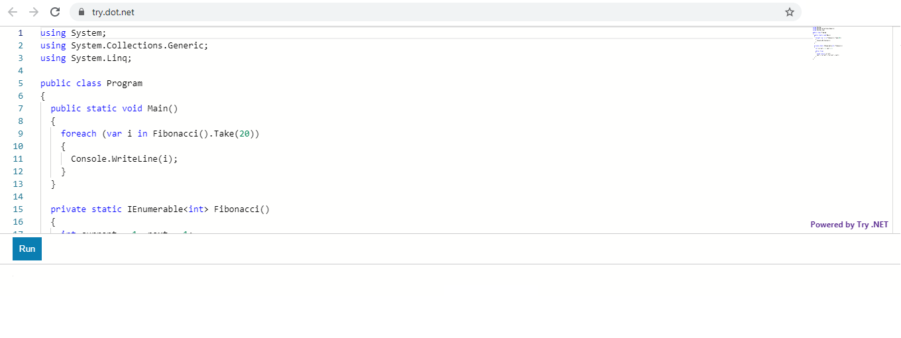

Recently I came accross a new C#/dotnet editor to code interactively in browser window. Through this online code editor we can create POC or practice c#. Users can run/edit code online in their browser without installing .net on their machine.

This is an open source tool, supported by Microsoft. Micosoft uses this tool on their documentation portal.
<https://docs.microsoft.com/en-us/dotnet/csharp/tutorials/intro-to-csharp/hello-world?tutorial-step=1>
 

[Try .NET](https://try.dot.net/)

Try this. Cheers!!
